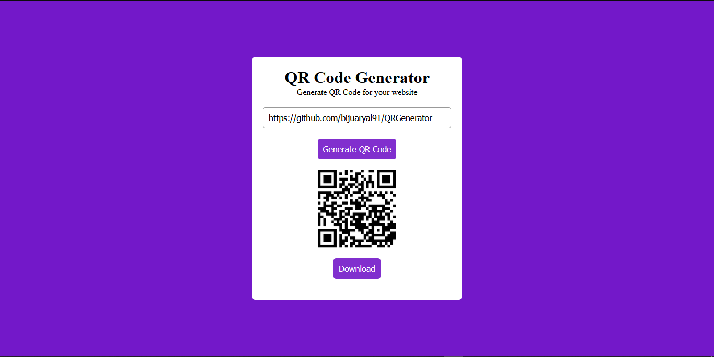

# QR Code Generator

A simple and efficient QR Code Generator built with JavaScript, HTML, and CSS. This tool allows users to create QR codes for any text or URL.


---

## Table of Contents

- [Features](#features)
- [Screenshots](#screenshots)
- [Tech Stack](#tech-stack)
- [Installation](#installation)
- [Usage](#usage)
- [Contributing](#contributing)

---

## Features

- **QR Code Generation**: Enter any text or URL to generate a corresponding QR code instantly.
- **Responsive Design**: Fully responsive and accessible on both desktop and mobile devices.


---

## Screenshots

### Main Page


---

## Tech Stack

- **Frontend**: HTML5, CSS3, JavaScript (Vanilla JS)

---

## Installation

### Prerequisites
- A modern web browser (Chrome, Firefox, Safari, etc.)
### Steps

1. **Clone the Repository**

   ```bash
   git clone https://github.com/bijuaryal91/QRGenerator.git
   cd QRGenerator

2. **Open the Application**
Open the index.html file in your preferred web browser to start using the QR Code Generator.


## Usage
1. **Enter Text/URL**: Type the text or URL you want to convert into a QR code.
2. **Generate QR Code**: Click the "Generate" button to create your QR code.
3. **Download**: Save your QR code in PNG or SVG format by clicking the download button.

## Contributing
1. Fork the repository
2. Create a new branch (git checkout -b feature-name)
3. Commit changes (git commit -m "Add new feature")
4. Push to the branch (git push origin feature-name)
5. Open a Pull Request
